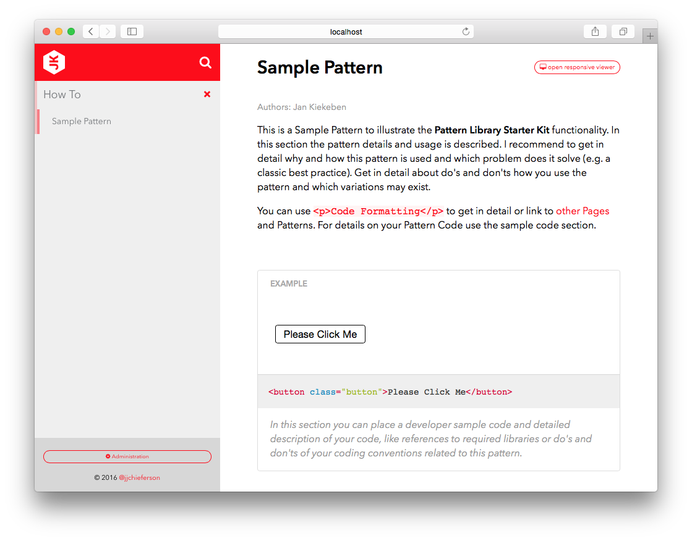

# Pattern Library Starterkit
A Kirby CMS based UI Pattern Library Starter Kit.
- Easy to setup
- Easy to use
- A must have for every digital web project

## Features
- File Based Kirby CMS based
- No Database required
- Installation on premise
- Iframe based Pattern Demo
- Responsive Pattern Viewer "ish" included
- Pattern data (Name, Author, Description & Developer Sample Code)
- Overview pages for easy structuring
- Simple pattern search included
- Kirby [FontAwesome](http://fontawesome.io/) Plugin included

## Dependencies & System Requirements
- A Kirby CMS installation (Version: 2.3.2)
- For Kirby CMS installation requirements & procedure please consult [Kirby installation manual](https://getkirby.com/docs/installation)
- Get a Kirby license if you are happy. You can purchase your Kirby license at https://getkirby.com/buy

## Installation
- Install and run the Kirby Starterkit
- Clone the repository or download the Pattern Library Starterkit
- Add/Replace the files & folders to their destination folders

## Issues and feedback
Please report issues and request new features on the [issues page](https://github.com/chieferson/pattern-library-starterkit/issues)

## Used 3rd Party Resources, Libraries and Plugins
This Pattern Library Starterkit wouldn't be possible without the stunning work of a worldwide open source community. A million thanks go to...

#### Icon Plugin for kirby
- Author & Copyright: Thies Hagedorn
- [Find it on Github](https://github.com/ThiesHagedorn/KirbyIconPlugin)

#### Responsive viewer "ish"
- Author & Copyright: Brad Frost
- [Find it on Github](https://github.com/bradfrost/ish.)

#### Kirby Comments Feature
- Author & Copyright: Addpixel
- [Find it on Github](https://github.com/Addpixel/KirbyComments)
